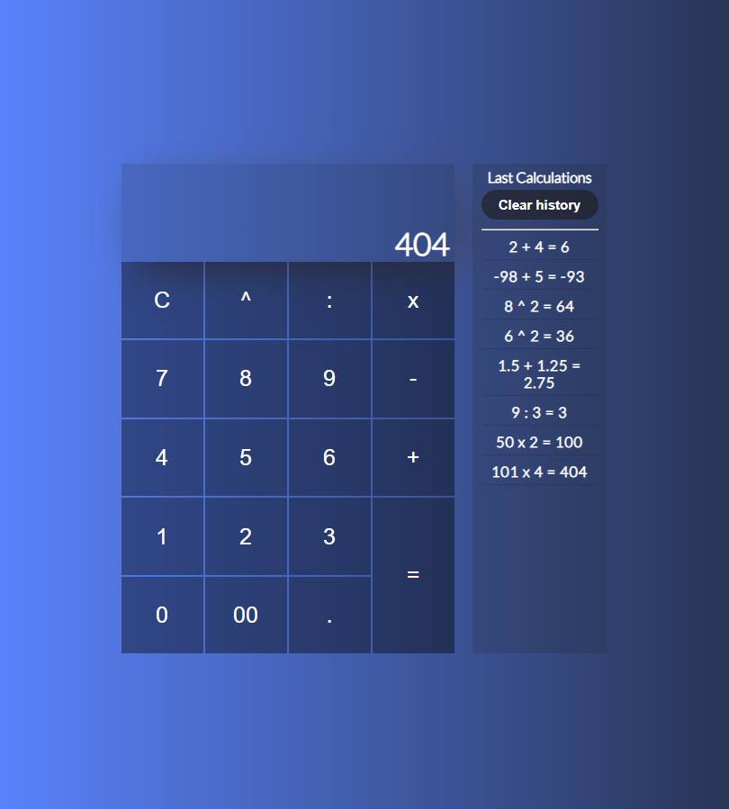

# JS Calculator

It allows you to operate on different numbers. Written using JavaScript, HTML and CSS.

## Demo

## Custom scrollbar
It has also a custom scrollbar, from there: [simplebar](https://github.com/Grsmto/simplebar/tree/master).

> Mentor of this project: [Mate Code](https://github.com/mateocode8933)
